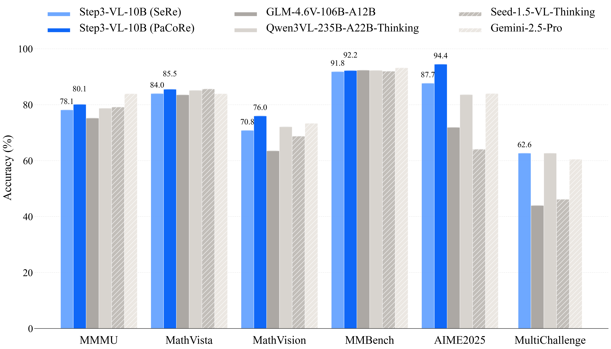

<div align="center">

<h1 style="border-bottom: none; display: inline-block;">
    
    <span style="vertical-align: middle;">STEP3-VL-10B</span>
</h1>


[](https://huggingface.co/stepfun-ai/Step3-VL-10B)
[](https://modelscope.cn/models/stepfun-ai/Step3-VL-10B)
[](https://stepfun-ai.github.io/Step3-VL-10B)
[]()

[**Introduction**](#introduction) | [**Performance**](#performance) | [**Quick Start**](#quick-start) | [**Citation**](#citation)

</div>

## 🚀 Introduction

**STEP3-VL-10B** is a lightweight open-source foundation model designed to redefine the trade-off between compact efficiency and frontier-level multimodal intelligence. Despite its compact **10B parameter footprint**, STEP3-VL-10B excels in **visual perception**, **complex reasoning**, and **human-centric alignment**. It consistently outperforms models under the 10B scale and rivals or surpasses significantly larger open-weights models (**10×–20× its size**), such as GLM-4.6V (106B-A12B), Qwen3-VL-Thinking (235B-A22B), and top-tier proprietary flagships like Gemini 2.5 Pro and Seed-1.5-VL.

<div align="center">

<p><i>Figure 1: Performance comparison of STEP3-VL-10B against SOTA multimodal foundation models. SeRe: Sequential Reasoning; PaCoRe: Parallel Coordinated Reasoning.</i></p>
</div>

The success of STEP3-VL-10B is driven by two key strategic designs:

1.  **Unified Pre-training on High-Quality Multimodal Corpus:** A single-stage, fully unfrozen training strategy on a 1.2T token multimodal corpus, focusing on two foundational capabilities: **reasoning** (e.g., general knowledge and education-centric tasks) and **perception** (e.g., grounding, counting, OCR, and GUI interactions). By jointly optimizing the Perception Encoder and the Qwen3-8B decoder, STEP3-VL-10B establishes intrinsic vision-language synergy.
2.  **Scaled Multimodal Reinforcement Learning and Parallel Reasoning:** Frontier capabilities are unlocked through a rigorous post-training pipeline comprising two-stage supervised finetuning (SFT) and **over 1,400 iterations of RL** with both verifiable rewards (RLVR) and human feedback (RLHF). Beyond sequential reasoning, we adopt **Parallel Coordinated Reasoning (PaCoRe)**, which allocates test-time compute to aggregate evidence from parallel visual exploration.

## 📥 Model Zoo

| Model Name | Type | Hugging Face | ModelScope |
|:-----------|:-----|:------------:|:----------:|
| **STEP3-VL-10B** | Chat | [🤗 Download](https://huggingface.co/stepfun-ai/Step3-VL-10B-Instruct) | [🤖 Download](https://modelscope.cn/models/stepfun-ai/Step3-VL-10B-Instruct) |
| **STEP3-VL-10B-Base** | Base | [🤗 Download](https://huggingface.co/stepfun-ai/Step3-VL-10B-Base) | [🤖 Download](https://modelscope.cn/models/stepfun-ai/Step3-VL-10B-Base) |

## 📊 Performance

STEP3-VL-10B delivers best-in-class performance across major multimodal benchmarks, establishing a new performance standard for compact models. The results demonstrate that STEP3-VL-10B is the **most powerful open-source model in the 10B parameter class**.

### Comparison with Larger Models (10×–20× Larger)

| Benchmark | STEP3-VL-10B (SeRe) | STEP3-VL-10B (PaCoRe) | GLM-4.6V (106B-A12B) | Qwen3-VL (235B-A22B) | Gemini-2.5-Pro | Seed-1.5-VL |
|:----------|:-------------------:|:---------------------:|:--------------------:|:--------------------:|:--------------:|:-----------:|
| **MMMU** | 78.11 | **80.11** | 75.20 | 78.70 | 83.89 | 79.11 |
| **MathVista** | 83.97 | **85.50** | 83.51 | 85.10 | 83.88 | 85.60 |
| **MathVision** | 70.81 | **75.95** | 63.50 | 72.10 | 73.30 | 68.70 |
| **MMBench (EN)** | 92.05 | 92.38 | 92.75 | 92.70 | **93.19** | 92.11 |
| **MMStar** | 77.48 | 77.64 | 75.30 | 76.80 | **79.18** | 77.91 |
| **OCRBench** | 86.75 | **89.00** | 86.20 | 87.30 | 85.90 | 85.20 |
| **AIME 2025** | 87.66 | **94.43** | 71.88 | 83.59 | 83.96 | 64.06 |
| **HMMT 2025** | 78.18 | **92.14** | 57.29 | 67.71 | 65.68 | 51.30 |
| **LiveCodeBench** | 75.77 | **76.43** | 48.71 | 69.45 | 72.01 | 57.10 |

<!-- > **Note:** **SeRe** (Sequential Reasoning) uses a max length of 64K tokens; **PaCoRe** (Parallel Coordinated Reasoning) synthesizes 16 SeRe rollouts with a max length of 128K tokens. -->

> **Note on Inference Modes:**
>
> **SeRe (Sequential Reasoning):** The standard inference mode using sequential generation (Chain-of-Thought) with a max length of 64K tokens.
>
> **PaCoRe (Parallel Coordinated Reasoning):** An advanced mode that scales test-time compute. It aggregates evidence from **16 parallel rollouts** to synthesize a final answer, utilizing a max context length of 128K tokens.
> 
> *Unless otherwise stated, scores below refer to the standard SeRe mode. Higher scores achieved via PaCoRe are explicitly marked.*

### Comparison with Open-Source Models (7B–10B)

| Category | Benchmark | STEP3-VL-10B | GLM-4.6V-Flash (9B) | Qwen3-VL-Thinking (8B) | InternVL-3.5 (8B) | MiMo-VL-RL-2508 (7B) |
|:---------|:----------|:------------:|:-------------------:|:----------------------:|:-----------------:|:--------------------:|
| **STEM Reasoning** | MMMU | **78.11** | 71.17 | 73.53 | 71.69 | 71.14 |
| | MathVision | **70.81** | 54.05 | 59.60 | 52.05 | 59.65 |
| | MathVista | **83.97** | 82.85 | 78.50 | 76.78 | 79.86 |
| | PhyX | **59.45** | 52.28 | 57.67 | 50.51 | 56.00 |
| **Recognition** | MMBench (EN) | **92.05** | 91.04 | 90.55 | 88.20 | 89.91 |
| | MMStar | **77.48** | 74.26 | 73.58 | 69.83 | 72.93 |
| | ReMI | **67.29** | 60.75 | 57.17 | 52.65 | 63.13 |
| **OCR & Document** | OCRBench | **86.75** | 85.97 | 82.85 | 83.70 | 85.40 |
| | AI2D | **89.35** | 88.93 | 83.32 | 82.34 | 84.96 |
| **GUI Grounding** | ScreenSpot-V2 | 92.61 | 92.14 | **93.60** | 84.02 | 90.82 |
| | ScreenSpot-Pro | **51.55** | 45.68 | 46.60 | 15.39 | 34.84 |
| | OSWorld-G | **59.02** | 54.71 | 56.70 | 31.91 | 50.54 |
| **Spatial** | BLINK | **66.79** | 64.90 | 62.78 | 55.40 | 62.57 |
| | All-Angles-Bench | **57.21** | 53.24 | 45.88 | 45.29 | 51.62 |
| **Code** | HumanEval-V | **66.05** | 29.26 | 26.94 | 24.31 | 31.96 |

### Key Capabilities

* **STEM Reasoning:** Achieves **94.43%** on AIME 2025 and **75.95%** on MathVision (with PaCoRe), demonstrating exceptional complex reasoning capabilities that outperform models 10×–20× larger.
* **Visual Perception:** Records **92.05%** on MMBench and **80.11%** on MMMU, establishing strong general visual understanding and multimodal reasoning.
* **GUI & OCR:** Delivers state-of-the-art performance on ScreenSpot-V2 (**92.61%**), ScreenSpot-Pro (**51.55%**), and OCRBench (**86.75%**), optimized for agentic and document understanding tasks.
* **Spatial Understanding:** Demonstrates emergent spatial awareness with **66.79%** on BLINK and **57.21%** on All-Angles-Bench, establishing strong potential for embodied intelligence applications.

## 🏗️ Architecture & Training

### Architecture

- **Visual Encoder:** PE-lang (Language-Optimized Perception Encoder), 1.8B parameters.
- **Decoder:** Qwen3-8B.
- **Projector:** Two consecutive stride-2 layers (resulting in 16× spatial downsampling).
- **Resolution:** Multi-crop strategy consisting of a 728×728 global view and multiple 504×504 local crops.

### Training Pipeline

- **Pre-training:** Single-stage, fully unfrozen strategy using AdamW optimizer (Total: 1.2T tokens, 370K iterations).
  - Phase 1: 900B tokens.
  - Phase 2: 300B tokens.
- **Supervised Finetuning (SFT):** Two-stage approach (Total: ~226B tokens).
  - Stage 1: 9:1 text-to-multimodal ratio (~190B tokens).
  - Stage 2: 1:1 text-to-multimodal ratio (~36B tokens).
- **Reinforcement Learning:** Total >1,400 iterations.
  - **RLVR:** 600 iterations (Tasks: mathematics, geometry, physics, perception, grounding).
  - **RLHF:** 300 iterations (Task: open-ended generation).
  - **PaCoRe Training:** 500 iterations (Context length: 64K max sequence).


## 🛠️ Quick Start

### Requirements

To run STEP3-VL-10B efficiently, we recommend setting up a Python environment (>=3.10) with **vLLM**:

```bash
pip install vllm>=0.6.3
```

### vLLM Inference Example

Below is a minimal example to load the model and generate a response using vLLM's chat API.

```python
from vllm import LLM, SamplingParams

# 1. Load the model
# Ensure you have ~24GB VRAM for BF16 inference
llm = LLM(
    model="stepfun-ai/Step3-VL-10B-Instruct",
    trust_remote_code=True,
    gpu_memory_utilization=0.95
)

# 2. Prepare input (Supports local paths or URLs)
messages = [
    {
        "role": "user",
        "content": [
            {"type": "image", "image": "[https://modelscope.oss-cn-beijing.aliyuncs.com/resource/demo.jpg](https://modelscope.oss-cn-beijing.aliyuncs.com/resource/demo.jpg)"},
            {"type": "text", "text": "Describe this image in detail."}
        ]
    }
]

# 3. Generate
sampling_params = SamplingParams(temperature=0.1, max_tokens=1024)
outputs = llm.chat(messages=messages, sampling_params=sampling_params)

print(f"Output: {outputs[0].outputs[0].text}")
```


## 📜 Citation

If you find this project useful in your research, please cite our technical report:

```tex

```

## 📄 License

This project is open-sourced under the [Apache 2.0 License](https://www.google.com/search?q=LICENSE).
